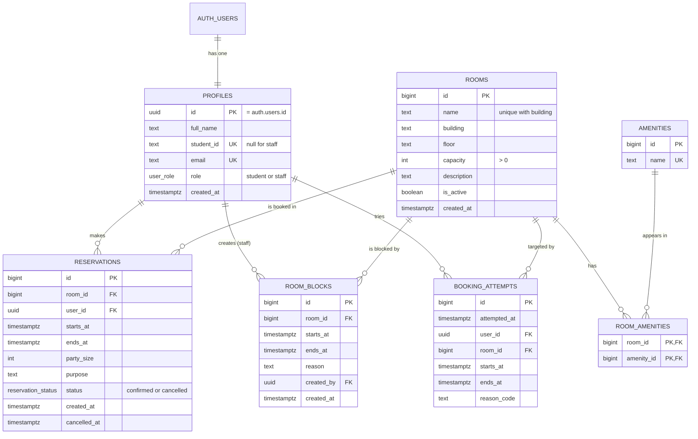

# SRRS Project Hub

Oct 4, 2026 · @Ryan A

## Overview

This hub keeps everything for the Study Room Reservation System (SRRS) in one place, so nothing gets lost between chats, Jira, and GitHub. We are in Sprint 1 (Oct 2–14); the midterm requirements paper is due Oct 22 at 5 p.m.

| Section | What it holds | Status |
| --- | --- | --- |
| Overview (this section) | Decisions so far and open questions | Current |
| User Stories | All 12 stories with acceptance criteria and tasks, by sprint | Draft, waiting on team review |
| API Contract | Every endpoint with example requests and responses | Draft v1 |
| Data Model | ER diagram, table reference, and steps to rebuild it in dbdiagram.io | Matches schema.sql v1.1 |

In Jira, only SRRS-1 exists so far. The rest ship after the team signs off on the stories.

## Decisions so far

| Area | Decision |
| --- | --- |
| Front end | React (Vite), one app with a student portal and a staff portal, styled with the official PVAMU purple (#582c83) and gold (#eaaa00) |
| Back end | Node.js with Express, talking to Supabase |
| Database | Supabase (Postgres) with Supabase Auth for sign-up and login. Live project: srrs-study-rooms (us-east-1, free tier), schema v1.1 and sample rooms loaded Oct 4 |
| Double-booking | Blocked by the database itself (exclusion constraint), not just app code |
| Security | Row-level security: students see only their own bookings; only staff change rooms and blocks |
| Booking rules (confirmed Oct 4) | Max 3 hours, no past times, party size up to room capacity, no blocked or closed rooms |
| Jira structure | Plain-language user stories; technical work goes in sub-tasks under each story |
| Sprint split | Sprint 1: 5 stories (accounts, login, browsing). Sprint 2: 5 stories (booking). Sprint 3: 2 admin stories plus testing |
| Branch names | Start with the Jira key, e.g. `SRRS-4-rooms-endpoint`, so commits show up on tickets |

## Open questions

- [ ] Team review of the 12 user stories, then ship them to Jira
- [ ] Where does the code live and get hosted? (GitHub repo link, plus hosting for the front end and the Node API)
- [ ] Install the GitHub for Jira app so branches and pull requests link to tickets
- [ ] Decide how far ahead students can book (max length is set at 3 hours)
- [ ] Set Sprint 1 dates to Oct 2–14 in Jira and start the sprint
- [ ] Fix the proposal: "eight-person team" vs. 7, and the duplicate role text for James and London

## Tomorrow: test accounts

1. Open the Supabase dashboard and go to the srrs-study-rooms project.
2. Go to Authentication → Users → Add user → Create new user.
3. Make one student account and one staff account, and check "Auto confirm user" for each.
4. Send Claude the staff email to switch that account to staff.

React app `.env.local` (already filled in):

```
VITE_SUPABASE_URL=https://jewsycggnmyaynlndobd.supabase.co
VITE_SUPABASE_ANON_KEY=sb_publishable_KDBiLTws1LjgSQ_DEgF1bg_rFTZRnad
VITE_USE_MOCK=true
```


---

## User Stories

12 stories across three sprints, written from the user's point of view; the technical work lives in each story's tasks. Status: draft, waiting on team review before shipping to Jira. **[BE]** = backend/database, **[FE]** = front end.

| # | Story | Sprint | Jira |
| --- | --- | --- | --- |
| 1 | Create an account | 1 | SRRS-1 (to be reworded) |
| 2 | Student login | 1 | — |
| 3 | Staff portal login | 1 | — |
| 4 | Browse rooms | 1 | — |
| 5 | See when a room is open | 1 | — |
| 6 | Book a room | 2 | — |
| 7 | See my bookings | 2 | — |
| 8 | Cancel a booking | 2 | — |
| 9 | Find rooms open at a time | 2 | — |
| 10 | Change my booking time | 2 | — |
| 11 | Admin center | 3 | — |
| 12 | Close rooms and block times | 3 | — |

### Sprint 1 — Accounts and browsing (Oct 2–14)

#### Story 1: As a student, I want to create an account so I can book rooms.

Acceptance criteria:
- I can sign up with my name, student ID, email, and password
- I can't sign up twice with the same email or student ID
- I see a clear message if something is missing or wrong

Tasks:
- [BE] Add name and student ID to user profiles (student ID unique)
- [BE] Set up sign-up through Supabase Auth
- [FE] Build the sign-up screen with error messages

#### Story 2: As a student, I want to log in so I can see my bookings.

Acceptance criteria:
- I can log in with my email and password
- I land on the student portal after logging in
- I can log out
- Wrong credentials show an error

Tasks:
- [BE] Set up the Node/Express project with a login check on every request
- [FE] Build the login screen
- [FE] Build the main student portal page and navigation

#### Story 3: As a staff member, I want to log in to a staff portal so I can manage rooms.

Acceptance criteria:
- Staff land on the staff portal after logging in
- Students can't open staff pages

Tasks:
- [BE] Add the role check (student vs. staff) and GET /me
- [BE] Create test student and staff accounts
- [FE] Build the main staff portal page
- [FE] Send each user to the right portal after login

#### Story 4: As a student, I want to browse rooms by size and features so I can find one that fits my group.

Acceptance criteria:
- I see each room's name, building, capacity, and features
- I can filter by group size and by features like a whiteboard or TV
- Closed rooms don't show up

Tasks:
- [BE] Set up the Supabase project and run the schema
- [BE] Load the sample rooms and features
- [BE] Build GET /rooms with filters
- [BE] Write the API contract doc
- [FE] Build the room list screen with filters

#### Story 5: As a student, I want to see when a room is open so I don't show up to a taken room.

Acceptance criteria:
- I can open a room and see its details
- I can pick a day and see which times are taken or blocked
- I can't see who booked a room

Tasks:
- [BE] Build GET /rooms/:id with busy times for a date range
- [FE] Build the room details screen with a day view of open times

### Sprint 2 — Reservations (Oct 15–28)

#### Story 6: As a student, I want to book a room under my name so it's held for me.

Acceptance criteria:
- I can pick a room, day, time, and group size and confirm the booking
- I get a confirmation when it goes through
- If the time is already taken, I get a clear "already booked" message
- I can't book closed or blocked rooms, past times, more than 3 hours, or more people than the room fits

Tasks:
- [BE] Build POST /reservations with clear errors (409 for conflicts)
- [BE] Write tests for conflicts, back-to-back bookings, and booking rules
- [FE] Build the booking form and confirmation screen

#### Story 7: As a student, I want to see my bookings.

Acceptance criteria:
- I see my upcoming and past bookings with room, date, and time

Tasks:
- [BE] Build GET /me/reservations
- [FE] Build the "My bookings" screen

#### Story 8: As a student, I want to cancel a booking so the room opens up for others.

Acceptance criteria:
- I can cancel an upcoming booking
- I get a confirmation
- The time opens back up for others

Tasks:
- [BE] Build the cancel endpoint
- [BE] Test that cancelling frees the slot
- [FE] Add a cancel button with a confirm prompt

#### Story 9: As a student, I want to find rooms that are open at a specific time so I don't have to check each room one by one.

Acceptance criteria:
- I pick a day, time, and group size, and see only rooms that are free and big enough

Tasks:
- [BE] Add a time filter to GET /rooms
- [FE] Add a date and time picker to the room list

#### Story 10: As a student, I want to change the time of my booking so I don't have to cancel and rebook.

Acceptance criteria:
- I can move my booking to another open time
- If the new time is taken, my original booking stays put

Tasks:
- [BE] Build the update-booking endpoint, with a test that the original stays if the change fails
- [FE] Build the edit booking screen

### Sprint 3 — Staff controls and testing (Oct 29–Nov 11)

#### Story 11: As a room admin, I want an admin center so I can see every booking and which rooms are full.

Acceptance criteria:
- I see all bookings: who, which room, and when
- I can filter by room, date, or student
- I can see which rooms are in use now, booked up, or open
- I can see rejected and duplicate booking attempts
- I can cancel any booking

Tasks:
- [BE] Add a table that logs rejected and duplicate booking attempts
- [BE] Build the admin endpoints: all bookings, room status, rejected attempts, cancel any booking
- [FE] Build the admin center dashboard with status indicators

#### Story 12: As a room admin, I want to close a room or block off times so students can't book them.

Acceptance criteria:
- I can add, edit, and close rooms
- I can block a room for a time period with a reason
- Students can't book blocked times, and they show as unavailable

Tasks:
- [BE] Build the room management endpoints (add, edit, close)
- [BE] Build the block-off-times endpoints
- [BE] Test that students can't book blocked times or use staff features
- [FE] Build the room management and block-off-times screens


---

## API Contract (v1 draft)

The React app talks to the Node/Express API at `/api`; the API talks to Supabase. Front end can build against these shapes today using mock data; the real endpoints match them.

### Conventions

| Rule | Detail |
| --- | --- |
| Base URL | `http://localhost:4000/api` in development |
| Auth | `Authorization: Bearer <Supabase access token>` on every endpoint except sign-up |
| Login | Front end calls Supabase directly (`supabase.auth.signInWithPassword`), then calls `GET /me` |
| JSON keys | camelCase |
| Times | ISO 8601 in UTC, e.g. `2026-10-20T15:00:00Z` |
| Errors | Always `{ "error": { "code": "ROOM_TAKEN", "message": "..." } }` |

### Endpoint summary

| Method | Path | Who | Story | Sprint |
| --- | --- | --- | --- | --- |
| POST | /auth/signup | Anyone | 1 | 1 |
| GET | /me | Signed in | 2, 3 | 1 |
| GET | /amenities | Signed in | 4 | 1 |
| GET | /rooms | Signed in | 4, 9 | 1 |
| GET | /rooms/:id | Signed in | 5 | 1 |
| POST | /reservations | Student | 6 | 2 |
| GET | /me/reservations | Student | 7 | 2 |
| POST | /reservations/:id/cancel | Owner or staff | 8, 11 | 2 |
| PATCH | /reservations/:id | Owner | 10 | 2 |
| GET | /admin/reservations | Staff | 11 | 3 |
| GET | /admin/rooms/status | Staff | 11 | 3 |
| GET | /admin/booking-attempts | Staff | 11 | 3 |
| POST, PATCH | /admin/rooms, /admin/rooms/:id | Staff | 12 | 3 |
| POST, DELETE | /admin/blocks, /admin/blocks/:id | Staff | 12 | 3 |

### Error codes

| HTTP | Code | When |
| --- | --- | --- |
| 400 | VALIDATION | Missing or badly formatted field (`details` lists which) |
| 400 | IN_PAST | Start time already passed |
| 400 | TOO_LONG | Booking longer than 3 hours |
| 400 | OVER_CAPACITY | Party size bigger than the room |
| 400 | ROOM_BLOCKED | Staff blocked that time |
| 400 | ROOM_INACTIVE | Room is closed |
| 401 | UNAUTHENTICATED | No token, or it expired |
| 403 | FORBIDDEN | Signed in, but not allowed (e.g. a student on /admin) |
| 404 | NOT_FOUND | No such room or reservation (or not yours) |
| 409 | ROOM_TAKEN | Overlaps a confirmed booking |
| 409 | EMAIL_TAKEN, STUDENT_ID_TAKEN | Sign-up duplicate |

### Sprint 1 — accounts and rooms

#### POST /auth/signup

Creates the Supabase account and profile in one step, so duplicate student IDs get a clear error.

```json
// request
{ "fullName": "Ryan Tucker", "studentId": "P00123456", "email": "rtucker@pvamu.edu", "password": "********" }

// 201
{ "id": "9b1c...", "email": "rtucker@pvamu.edu" }

// 409
{ "error": { "code": "STUDENT_ID_TAKEN", "message": "An account already uses that student ID." } }
```

#### GET /me

```json
// 200
{ "id": "9b1c...", "fullName": "Ryan Tucker", "studentId": "P00123456", "email": "rtucker@pvamu.edu", "role": "student" }
```

Front end uses `role` to send the user to `/student` or `/staff`.

#### GET /amenities

```json
// 200
[ { "id": 1, "name": "Whiteboard" }, { "id": 2, "name": "TV / HDMI" } ]
```

#### GET /rooms

Query (all optional): `minCapacity`, `amenityIds` (comma list), `start` + `end` (Sprint 2: only rooms free for that whole window). Closed rooms never appear.

```json
// GET /rooms?minCapacity=4&amenityIds=1,2
[
  { "id": 3, "name": "Study Room 201", "building": "Library", "floor": "2", "capacity": 8,
    "description": "Presentation practice room", "amenities": ["TV / HDMI", "Webcam", "Whiteboard"] }
]
```

#### GET /rooms/:id

Query: `from`, `to` (defaults to today). Busy times never include who booked.

```json
// 200
{ "id": 3, "name": "Study Room 201", "building": "Library", "floor": "2", "capacity": 8,
  "description": "Presentation practice room", "amenities": ["TV / HDMI", "Webcam", "Whiteboard"],
  "busy": [
    { "start": "2026-10-20T15:00:00Z", "end": "2026-10-20T17:00:00Z", "kind": "reserved" },
    { "start": "2026-10-20T20:00:00Z", "end": "2026-10-20T23:00:00Z", "kind": "blocked" }
  ] }
```

### Sprint 2 — reservations

#### POST /reservations

```json
// request
{ "roomId": 3, "start": "2026-10-20T18:00:00Z", "end": "2026-10-20T19:30:00Z", "partySize": 5, "purpose": "CS group project" }

// 201
{ "id": 42, "roomId": 3, "roomName": "Study Room 201", "start": "2026-10-20T18:00:00Z", "end": "2026-10-20T19:30:00Z",
  "partySize": 5, "purpose": "CS group project", "status": "confirmed", "createdAt": "2026-10-18T14:02:11Z" }

// 409
{ "error": { "code": "ROOM_TAKEN", "message": "That room is already booked for part of that time." } }
```

#### GET /me/reservations

Query: `scope=upcoming` (default) or `past`. Returns an array of the reservation shape above.

#### POST /reservations/:id/cancel

No body. Returns the reservation with `"status": "cancelled"` and `cancelledAt`. Students can cancel only their own upcoming bookings; staff can cancel any.

#### PATCH /reservations/:id

Body: any of `start`, `end`, `partySize`. Same errors as POST. If the change fails, the original booking is untouched.

### Sprint 3 — admin (staff only)

#### GET /admin/reservations

Query: `roomId`, `date`, `studentId`, `status`. Same shape as a reservation, plus `student: { fullName, studentId, email }`.

#### GET /admin/rooms/status

```json
// 200
[ { "roomId": 3, "name": "Study Room 201", "status": "in_use", "bookingsToday": 4, "nextFreeAt": "2026-10-20T19:30:00Z" },
  { "roomId": 5, "name": "Collab Room A", "status": "closed", "bookingsToday": 0, "nextFreeAt": null } ]
```

`status` is one of `open`, `in_use`, `closed`. What counts as "full" for the day is an open question (it needs building hours).

#### GET /admin/booking-attempts

Rejected and duplicate attempts, newest first: `{ id, at, student, roomId, start, end, reasonCode }`.

#### Rooms and blocks

- `POST /admin/rooms` and `PATCH /admin/rooms/:id`: `{ name, building, floor, capacity, description, isActive, amenityIds }`
- `POST /admin/blocks`: `{ roomId, start, end, reason }` → 201 with the block
- `DELETE /admin/blocks/:id` → 204


---

## Data Model (schema v1.1)

Seven tables, built around one rule: two confirmed reservations for the same room can never overlap. This matches `schema.sql` v1.1, live in the Supabase project srrs-study-rooms.

### ER diagram



### Relationships

| From | To | Type | On delete |
| --- | --- | --- | --- |
| profiles.id | auth.users.id | one-to-one | cascade |
| reservations.user_id | profiles.id | many-to-one | blocked (keep history) |
| reservations.room_id | rooms.id | many-to-one | blocked (keep history) |
| room_blocks.room_id | rooms.id | many-to-one | cascade |
| room_blocks.created_by | profiles.id | many-to-one | no action |
| room_amenities.room_id | rooms.id | many-to-many link | cascade |
| room_amenities.amenity_id | amenities.id | many-to-many link | cascade |
| booking_attempts.user_id | profiles.id | many-to-one | set null |
| booking_attempts.room_id | rooms.id | many-to-one | set null |

### Rules the diagram can't show

These live in the database, so a diagram tool won't draw them; list them as notes on the diagram.

| Rule | Where it lives |
| --- | --- |
| No overlapping confirmed bookings for the same room | Exclusion constraint `no_double_booking` (needs the `btree_gist` extension) |
| Back-to-back is fine (2:00–3:00 then 3:00–4:00) | Time ranges are half-open `[start, end)` |
| Cancelled bookings free the slot | The constraint only applies where `status = 'confirmed'` |
| End after start, max 3 hours | Check constraints `valid_window`, `max_length` |
| No closed rooms, blocked times, past starts, or over-capacity parties | Trigger `check_reservation_rules` |
| A profile is created on sign-up | Trigger `on_auth_user_created` |
| Students see only their own bookings; staff see all | Row-level security policies |

### Rebuild it in dbdiagram.io

1. Go to dbdiagram.io and create a new diagram.
2. Delete the sample code in the left panel and paste the DBML below.
3. The diagram draws itself; drag tables so `rooms` and `reservations` sit in the middle.
4. Export as PNG or PDF for the midterm paper (Export menu, top right).

The same DBML works in other tools that read DBML; for draw.io or Lucidchart, copy the tables and the Relationships table above by hand.

```dbml
Project SRRS {
  database_type: 'PostgreSQL'
  Note: 'Study Room Reservation System, schema v1.1'
}

Enum user_role {
  student
  staff
}

Enum reservation_status {
  confirmed
  cancelled
}

Table auth_users {
  id uuid [pk, note: 'Managed by Supabase Auth']
  email text
}

Table profiles {
  id uuid [pk, ref: - auth_users.id]
  full_name text [not null]
  student_id text [unique, note: 'null for staff']
  email text [not null, unique]
  role user_role [not null, default: 'student']
  created_at timestamptz [not null, default: `now()`]
}

Table rooms {
  id bigint [pk, increment]
  name text [not null]
  building text [not null]
  floor text
  capacity int [not null, note: 'must be > 0']
  description text
  is_active boolean [not null, default: true]
  created_at timestamptz [not null, default: `now()`]
  indexes {
    (building, name) [unique]
  }
}

Table amenities {
  id bigint [pk, increment]
  name text [not null, unique]
}

Table room_amenities {
  room_id bigint [ref: > rooms.id]
  amenity_id bigint [ref: > amenities.id]
  indexes {
    (room_id, amenity_id) [pk]
  }
}

Table reservations {
  id bigint [pk, increment]
  room_id bigint [not null, ref: > rooms.id]
  user_id uuid [not null, ref: > profiles.id]
  starts_at timestamptz [not null]
  ends_at timestamptz [not null]
  party_size int [not null, default: 1]
  purpose text
  status reservation_status [not null, default: 'confirmed']
  created_at timestamptz [not null, default: `now()`]
  cancelled_at timestamptz
  Note: 'No two confirmed reservations for the same room may overlap (exclusion constraint). Max 3 hours. ends_at > starts_at.'
}

Table room_blocks {
  id bigint [pk, increment]
  room_id bigint [not null, ref: > rooms.id]
  starts_at timestamptz [not null]
  ends_at timestamptz [not null]
  reason text
  created_by uuid [ref: > profiles.id]
  created_at timestamptz [not null, default: `now()`]
  Note: 'Staff closures. Reservations cannot overlap a block.'
}

Table booking_attempts {
  id bigint [pk, increment]
  attempted_at timestamptz [not null, default: `now()`]
  user_id uuid [ref: > profiles.id]
  room_id bigint [ref: > rooms.id]
  starts_at timestamptz
  ends_at timestamptz
  reason_code text [not null, note: 'ROOM_TAKEN, ROOM_BLOCKED, OVER_CAPACITY, ...']
  Note: 'Rejected and duplicate booking attempts, for the admin center'
}
```
